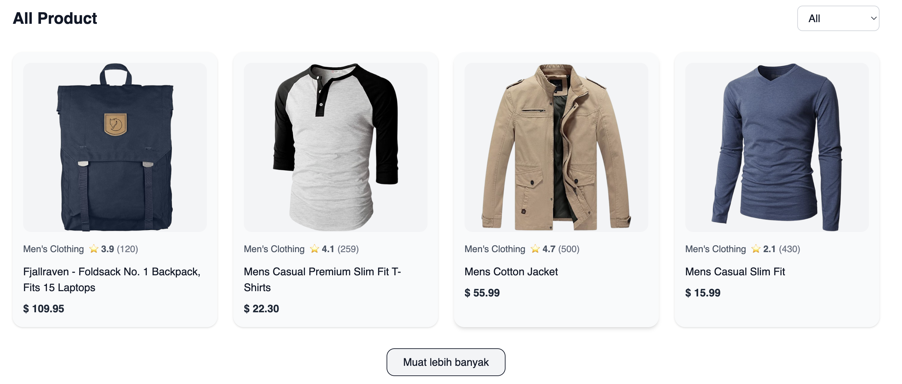
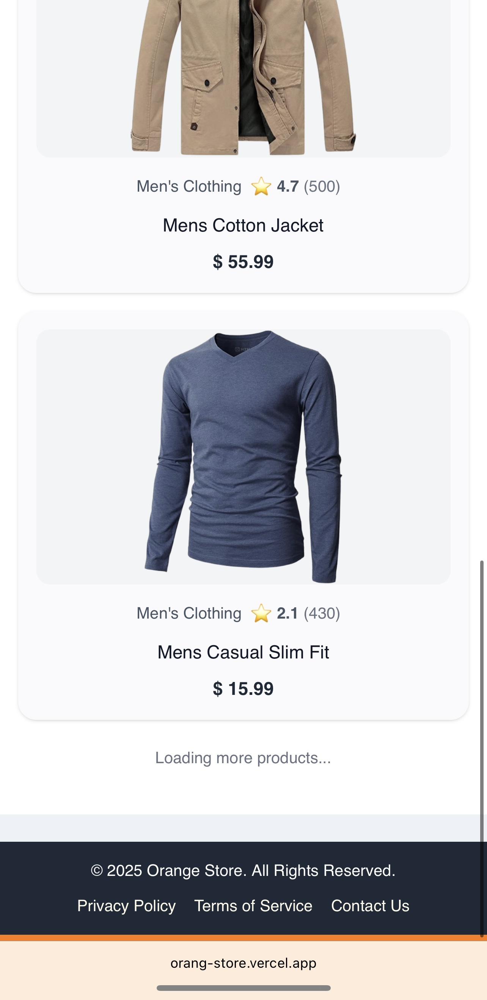
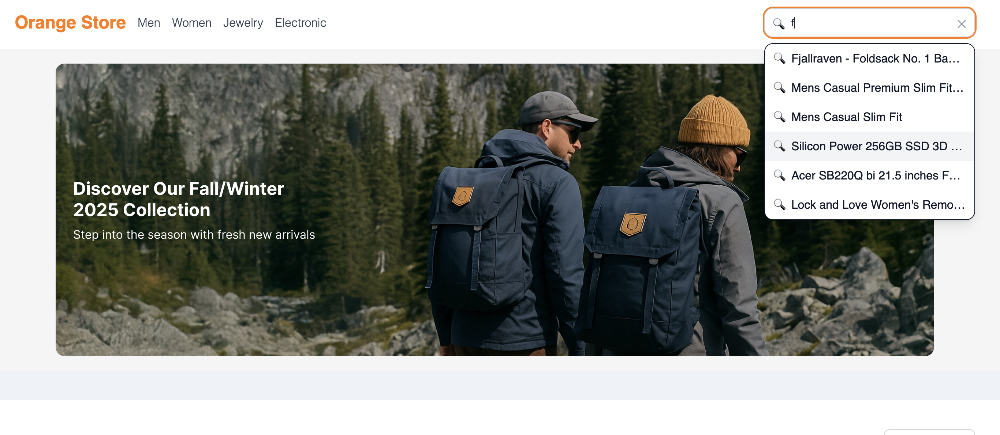

After you run 'npm install' or 'yarn install' then, itu will be ready to run locally, i just wanna short info about the apps. the first one is there is a different mobile view and desktop view and also from the handler. i used infinite scroll when only on mobile view, but on desktop it using trigger button. and for the search since it not allowed to request to API, so i make it handled my front, it search base on title and my type of search is whenever it contains or includes in the title then it will comes to suggestion popup like the screenshot below.

desktop view: 
mobile view: 
search view: 

and i also deploy it to vercel, so you can can check it.


and i also add some additional SEO ssr, but i don't think it will be enough.

## Setup

Make sure to install dependencies:

```bash
# npm
npm install

# pnpm
pnpm install

# yarn
yarn install

# bun
bun install
```

## Development Server

Start the development server on `http://localhost:3000`:

```bash
# npm
npm run dev

# pnpm
pnpm dev

# yarn
yarn dev

# bun
bun run dev
```

## Production

Build the application for production:

```bash
# npm
npm run build

# pnpm
pnpm build

# yarn
yarn build

# bun
bun run build
```

Check out the [deployment documentation](https://nuxt.com/docs/getting-started/deployment) for more information.
